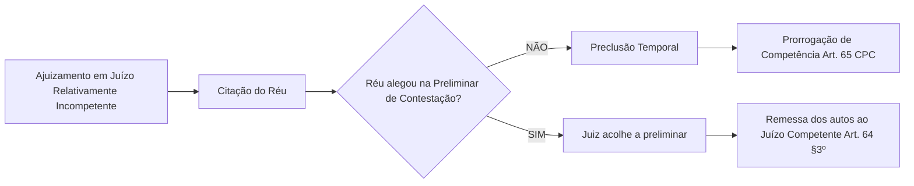

# Guia de Revisão e Aprofundamento do CPC: Competência Processual Civil

> [!IMPORTANT]
> **Aviso de Prova / Orientações do Professor**: Este material foi elaborado com base no áudio de revisão da aula de Direito Processual Civil (CPC/2015). O professor destacou explicitamente que as questões da prova exigirão **precisão técnica estrita** e justificativas fundamentadas na legislação processual. Responder de forma genérica resultará em anulação ou nota zero na questão.

---

## 📜 1. Transcrição do Áudio & Resumo Original da Aula

<details>
<summary>🔍 Clique para expandir a transcrição na íntegra do áudio</summary>

```text
Olá. Relativo. Competência relativa. Só cabe prorrogação de competência na competência relativa, tá? Eh, outra questão sobre prorrogação. Esqueci a prova. Eh, ah, por que a prorrogação de competência só pode acontecer na competência relativa. É aquela onde as partes ela só é relativa, uma das partes concorda. Não, a sua informação não está errada, mas só não já não responda minha pergunta. Minha pergunta é por que só ocorre prorrogação de competência na competência relativa. A competência relativa, pessoal, ela, a, ou melhor dizendo, a incompetência relativa, ela deve ser alegada em que momento processual? Contestação.

Na contestação. Em que partes da contestação? E aí já vou alertar, tá? Se for questionado isso na prova e você responder contestação, será considerado errado. O que está impotentemente errado. Ela não respondeu minha pergunta em que eu quero saber especificamente em que parte da contestação tem que ser alegado o que é o que a lei fala. Exatamente. Nessa vai competência você vai abrir o tópico da preliminar de contestação na, né, de competência na contestação. Então a incompetência relativa deve ser arguida em preliminar de contestação, tá bom? Não é só na contestação, porque se eu fizer como pedido de mérito a incompetência na contestação, vai estar correto? Não, porque a lei fala que tem que ser como preliminar de contestação. O que isso influences no processo? Nós já discutimos, porque o juiz tem que analisar se ele é competente ou não antes dele analisar o mérito. Se você arguir incompetência do juiz após ele analisar o mérito, você já vai ter feito todo mundo perder tempo, porque se o juiz se considera incompetente, ele já vai ter aplicado aquela matéria que ele nem precisaria analisar porque ele é incompetente. Ficou claro porque Pronto. Então, sobre prorrogação, estamos tranquilos também. O que é que tá faltando para ficar só mais? Últimos tópicos de questionamento. Qual é a diferença da competência absoluta para relativa?

É que a absoluta pode ser declarada em qualquer fase processual.

Pode ser declarada em qualquer fase processual. É uma diferença. Tem exceção essa regra?

A não pode ser especificada.

Antes da gente antes da gente seguir, vamos pegar aqui o ponto do colega, a incompetência absoluta pode ser arguida em qualquer fase processual. Tem exceção a essa regra?

Tem, eu acho que não é na instância mais alta, né? Que ela não tem que ser alegada antes. Ela não é para quando ela não pode ser alegada nem no STJ, nem no STF. É qualquer recurso, eu tenho recursos específicos.

Recursos especiais. Recurso especial.

O recurso especial é de onde? STJ e o extraordinário STF. Então eu não posso argumentar incompetência absoluta do juízo nesses dois recursos se não houver prequestionamento. Se a justificativa porque não pode, né? OK. Então além dessa distinção, quais são as outras? Vocês já falaram.

Não pode ser quem da competência absoluta. Competência absoluta no caso de modificação e transação pelas partes. Relativa a russa pode eh é de ordem pública.

Absoluto de ordem relativa pública é do interesse das partes.

Das partes. O que mais? Pelo menos temos, pelo menos mais dois. Pode ser de qual relativo a opção a opção absoluta pode ser reconhecida de ofício relativo? Podemos não não pode. Mais um mais uma diferença fundada na matéria função ou pessoa, certo? Quem pode, é uma diferença também. Além disso, quem pode sofrer o até já falamos hoje, quem pode sofrer o efeito da prorrogação socar a prorrogação na competência relativo.

Relativo, certo? OK. Por que não há prorrogação na competência absoluta? Especialmente com essa pergunta, o silêncio de vocês me preocupa. Então é um é um sinal, né? Nós precisamos É porque como mais interesse é aquilo que fala sobre interesse público, que protege o interesse público, não? Porque a incompetência absoluta pode ser arguida em qualquer fase processual, porque nós já afirmamos aqui hoje. Para garantir, eu posso, a regra é a incompetência absoluta pode ser arguida, alegada em qualquer fase processual, porque estamos falando que ela pode ser discutida dentro do processo, não é? Mas eu posso argumentar, posso levantar essa matéria de incompetência absoluta após a finalização do processo pelo trânsito em julgado? Não, porque ela anula todo o processo, né? Então não foi levantado antes. É. já fez coisa julgada, já fez coisa julgada.

Então eu não poderia, mas eu posso. Através de quê? Qual instrumento, ação rescisória. Exatamente. OK. Guardem essas informações de coração. Se intimamente você teve muita dificuldade de responder essas perguntas aqui, estude mais, porque você vai ter que responder questões mais ou menos assim na prova.
```
</details>

---

## 🎯 2. Aprofundamento Técnico-Jurídico dos Tópicos Cobrados

---

### TÓPICO 1: Incompetência Relativa e Arguição em Preliminar de Contestação

> [!WARNING]
> **PEGADINHA DE PROVA**: Se a questão perguntar onde/quando se alega a incompetência relativa e você responder apenas *"Na Contestação"*, a resposta será considerada **ERRADA**. 

#### A) Onde e Como Alegar (Art. 64 e Art. 337, II do CPC/2015)
* **Base Legal Integrada**:
  * **Art. 64, caput, CPC**: *"A incompetência, absoluta ou relativa, será alegada como questão preliminar de contestação."*
  * **Art. 337, II, CPC**: *"Incumbe ao réu, antes de discutir o mérito, alegar: [...] II - incompetência absoluta e relativa;"*
* **Mudança do CPC/73 para o CPC/2015**: No código antigo (CPC/1973), a incompetência relativa exigia uma peça autônoma em apenso chamada *Exceção de Incompetência*. No CPC/2015, a exceção autônoma foi **extinta**. Agora, a incompetência relativa é arguida diretamente na própria peça de **Contestação**, mas obrigatoriamente dentro do tópico de **PRELIMINAR**.

#### B) Por que exige a forma de Preliminar? (Fundamentação Teórico-Processual)
1. **Lógica de Prejudicialidade e Ordem dos Julgamentos**:
   * As matérias de preliminar (defesas processuais/formais) antecedem logically a análise do mérito (o direito material discutido).
   * O juiz necessita **afirmar sua competência legal** antes de resolver o litígio (art. 487 do CPC).
2. **Princípio da Economia Processual e Eficiência**:
   * Se a incompetência fosse deduzida como pedido de mérito ou analisada ao final, o juiz e as partes despenderiam tempo e atos instrutórios (perícias, oitivas de testemunhas, audiências) em um juízo incompetente.
   * Reconhecida a incompetência na preliminar, o processo é imediatamente remetido ao juízo competente (Art. 64, § 3º, CPC), aproveitando-se os atos praticados ou determinando a ratificação pelo juízo competente (Art. 64, § 4º, CPC).

---

### TÓPICO 2: Prorrogação da Competência (Art. 65 do CPC)

> [!KEY]
> **Conceito de Prorrogação**: É a transformação de um juízo originalmente incompetente em um juízo competente para a causa, decorrente da inércia das partes.



#### A) Por que a Prorrogação SÓ OCORRE na Competência Relativa?
* **Natureza do Interesse (Disponibilidade)**:
  * A competência relativa engloba critérios de **território** (foro do domicílio, local do fato) e **valor da causa**.
  * Esses critérios foram criados pela lei para proteger a conveniência e o **interesse privado das partes** (direitos disponíveis).
  * Se o réu é citado em foro diverso e **não se opõe em preliminar de contestação**, a lei interpreta o seu silêncio como concordância tácita. Opera-se a **preclusão temporal** (perda da faculdade processual de alegar), e a competência se prorroga (fixa-se definitivamente naquele juízo).

#### B) Por que a Competência Absoluta NUNCA se Prorroga?
* **Natureza de Ordem Pública (Indisponibilidade)**:
  * A competência absoluta protege o **interesse público**, a organização judiciária e o interesse da administração da Justiça (critérios de matéria, pessoa ou função).
  * As partes não têm o poder de dispor nem de "validar" a incompetência absoluta pelo silêncio. Por isso, a incompetência absoluta **não preclui** na fase de conhecimento e **nunca sofre prorrogação** (Art. 64, § 1º, CPC).

---

### TÓPICO 3: Tabela Comparativa Exaustiva (Competência Absoluta vs. Relativa)

| Critério Processual | Competência Absoluta | Competência Relativa | Base Legal (CPC/2015) |
| :--- | :--- | :--- | :--- |
| **Interesse Tutelado** | **Ordem Pública** (Interesse da Justiça/Estado) | **Ordem Privada** (Interesse e conveniência das partes) | Doutrina / Art. 62 e 63 |
| **Critérios de Fixação** | **Matéria** (*ratione materiae*), **Pessoa** (*ratione personae*) e **Função** (*ratione functionis*) | **Território** (*ratione loci*) e **Valor da Causa** (*ratione valoris*) | Arts. 44, 46, 53 e 62 |
| **Declaração de Ofício pelo Juiz** | **SIM**. Deve ser declarada de ofício a qualquer tempo pelo juiz. | **NÃO**. Não pode ser declarada de ofício (salvo exceção em contrato de adesão). | Art. 64, § 1º / Súmula 33 STJ / Art. 63, § 3º |
| **Modificação por Convenção (Foro de Eleição)** | **IMPOSSÍVEL** (Inderrogável pela vontade das partes). | **POSSÍVEL** (Derrogável por cláusula de eleição de foro). | Art. 62 vs. Art. 63 |
| **Fenômeno da Prorrogação** | **NÃO OCORRE**. O silêncio não convalida nem torna o juízo competente. | **OCORRE**. Se o réu não alegar na preliminar da contestação, a competência se prorroga. | Art. 65 |
| **Momento de Arguição / Preclusão** | **A qualquer tempo e grau ordinário de jurisdição**. Não preclui durante o processo. | **Estritamente na Preliminar de Contestação**. Se não alegada, preclui. | Art. 64, § 1º vs. Art. 337, II |

> [!NOTE]
> **Ressalva Importante (Ações Reais Imobiliárias - Art. 47 CPC)**:
> Via de regra, a competência territorial é relativa. Contudo, nas **ações reais imobiliárias** (litígios sobre propriedade, vizinhança, servidão, posse de imóveis), o foro do local do imóvel (*forum rei sitae*) é de **competência ABSOLUTA** (Art. 47, § 1º e § 2º, CPC).

---

### TÓPICO 4: Exceções, Limitações nos Tribunais Superiores e Fase Pós-Julgado

O professor destacou duas exceções cruciais à regra de que *"a incompetência absoluta pode ser alegada a qualquer tempo e fase processual"*:

#### 1. Limitação nos Tribunais Superiores (STJ e STF) — Exigência do Prequestionamento
* **O Problema**: A parte pode arguir a incompetência absoluta pela 1ª vez diretamente no Recurso Especial (STJ) ou Recurso Extraordinário (STF)?
* **Regra Técnica**: **NÃO**, sem o devido **prequestionamento**.
* **Fundamentação**:
  * Os recursos para o STJ (Art. 105, III, CF) e STF (Art. 102, III, CF) exigem que a matéria federal/constitucional tenha sido efetivamente debatida e decidida pelo Tribunal de origem (*acórdão recorrido*).
  * A jurisprudência pacífica do STJ e STF (Súmulas 282 e 356 do STF, Súmula 211 do STJ) estabelece que **matérias de ordem pública** (incluindo a incompetência absoluta) **não prescindem do prequestionamento** para serem examinadas na instância extraordinária.

#### 2. Efeito do Trânsito em Julgado — Ação Rescisória (Art. 966, II do CPC)
* **O Problema**: E se o processo for finalizado e ocorrer o trânsito em julgado de uma sentença proferida por juiz absolutamente incompetente? A incompetência absoluta pode ser alegada por petição simples?
* **Regra Técnica**: **NÃO**. Após o trânsito em julgado, opera-se a **coisa julgada material** e o processo se encerra definitivamente.
* **O Instrumento Adequado**: A desconstituição dessa sentença proferida por juízo absolutamente incompetente só é possível mediante a propositura de **AÇÃO RESCISÓRIA**.
* **Base Legal Integrada**:
  * **Art. 966, II, CPC**: *"A decisão de mérito, transitada em julgado, pode ser rescindida quando: [...] II - for proferida por juiz absolutamente incompetente ou por juízo impedido;"*
  * **Prazo Decadencial**: 2 (dois) anos, contados do trânsito em julgado da última decisão proferida no processo (Art. 975, CPC).

---

## 📝 3. Guia Rápido de Respostas para a Prova (Gabarito Técnico)

Se o professor fizer as seguintes perguntas na prova, utilize os moldes de resposta abaixo:

### ❓ Pergunta 1: Em que momento e de que forma deve ser arguida a incompetência relativa?
> ** Resposta Padrão Ouro**: A incompetência relativa deve ser arguida obrigatoriamente como **preliminar na peça de contestação**, nos termos do **Art. 64, caput, c/c o Art. 337, inciso II, do CPC/2015**. Não basta alegar "na contestação" genericamente ou no mérito; deve constituir capítulo preliminar, sob pena de preclusão e consequente prorrogação da competência (Art. 65 do CPC).

### ❓ Pergunta 2: Por que a prorrogação da competência só ocorre na competência relativa e nunca na absoluta?
> ** Resposta Padrão Ouro**: A prorrogação só ocorre na competência relativa porque esta visa tutelar o **interesse privado das partes** (direitos disponíveis). Havendo inércia do réu ao não alegar a incompetência na preliminar de contestação, opera-se a preclusão e o direito presume sua aceitação tacitamente (Art. 65 do CPC). Já a competência absoluta é fundada no **interesse público e na ordem pública**, sendo inderrogável pela vontade ou pelo silêncio das partes (Art. 62 e Art. 64, § 1º, CPC).

### ❓ Pergunta 3: A incompetência absoluta pode ser alegada em qualquer fase processual sem restrições?
> ** Resposta Padrão Ouro**: A regra geral é que a incompetência absoluta pode ser alegada em qualquer tempo e grau ordinário de jurisdição, devendo ser declarada de ofício pelo juiz (Art. 64, § 1º, CPC). **Contudo, existem duas exceções/limitações imperativas**:
> 1. **Instâncias Extraordinárias (STJ/STF)**: Não pode ser conhecida ou examinada em sede de Recurso Especial ou Extraordinário sem o preenchimento do requisito constitucional do **prequestionamento** (Súmulas 282/STF e 211/STJ).
> 2. **Após o Trânsito em Julgado**: Formada a coisa julgada, a incompetência absoluta não pode mais ser conhecida no âmbito daquele processo findo, devendo ser desconstituída exclusivamente via **Ação Rescisória**, fundada no **Art. 966, inciso II, do CPC**, no prazo decadencial de 2 anos (Art. 975 do CPC).
