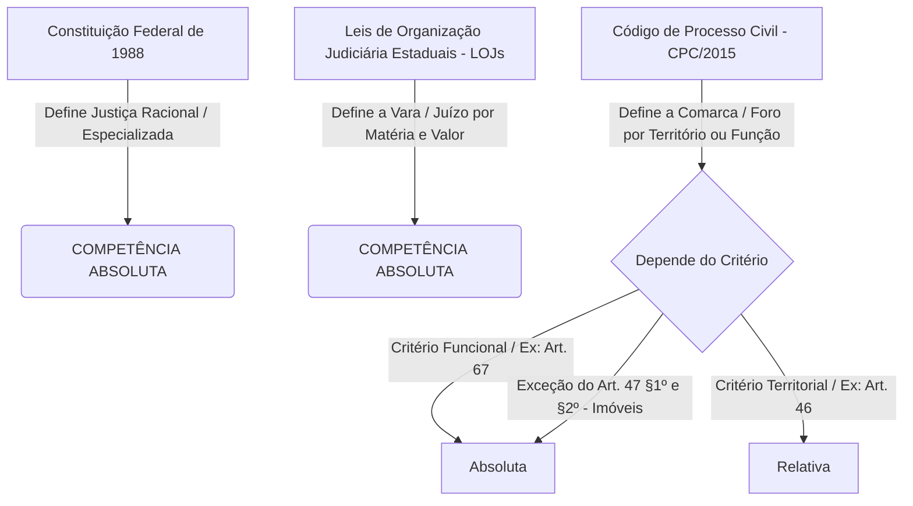
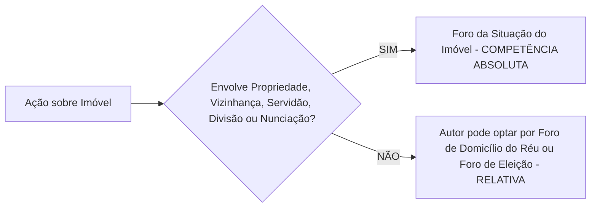
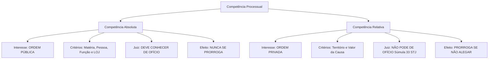
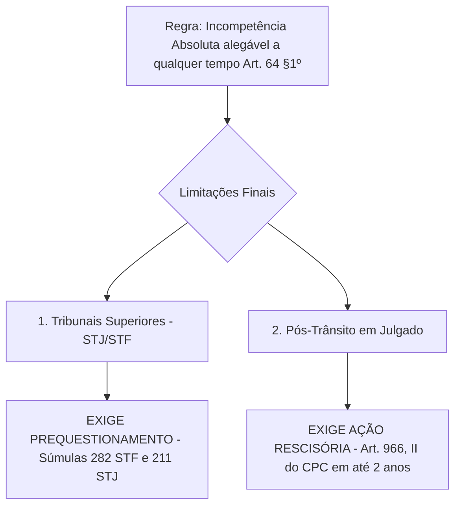

# Guia Mestre de Processo Civil: Competência Processual (CPC/2015)

> [!IMPORTANT]
> **Orientações de Prova do Professor**: Este material consolida toda a aula gravada e transcreve a análise aprofundada dos **Artigos 46 a 53 e 64 a 67 do CPC/2015**, destacando os pontos de pegadinha exigidos em avaliações acadêmicas e no exame da OAB. A precisão terminológica e a fundamentação legal nos artigos do CPC são indispensáveis.

---

## 📜 1. Transcrição Fidedigna do Áudio da Aula do Professor

<details>
<summary>🔍 Clique aqui para expandir a transcrição completa do áudio original</summary>

```text
relativa. Nós vimos que nossa análise começa a eh na Constituição Federal, né? Depois nós vamos para as leis federais, que no nosso caso a o regramento máximo que trata de competência processual é o Código de Processo Civil. A nível de estado, para a fixação, principalmente do juízo, nós vamos ter as leis de organização judiciária, que aí vai mudar de estado para estado. E eventualmente nós analisamos as constituições dos estados. Na prática, isso acaba que nem acontece muito essa análise. A Constituição estabelece se a ação é de competência de alguma das justiças especiais, como nós já vimos. Eh, quais são as justiças especiais ou especializadas?

Trabalho, eleitoral, militar.

Depois se justiça federal ou estadual, que é que puxa a competência para a justiça federal. O que aqui nessa classificação de competência, qual é o critério que arrasta pra Justiça Federal a competência?

A presença da União e dos seus entes, né, da administração indireta, presente no processo, seja como parte ou como interessado, tá? A simples participação dessas pessoas já puxa a competência para a justiça federal. A gente tem algumas exceções a essa regra. Por exemplo, se for um processo de falência, se obviamente se for matéria trabalhista, né, vai para a Justiça do Trabalho, mas via de regra, está presente a União ou pessoas da administração indireta federal, a competência é da justiça federal, os demais outros processos são da justiça estadual. Professor, caso, um exemplo, caso processe o Banco do Brasil para alguém, alguma irregularidade nesses casos em qualquer banco, seria no federal? Não, depende da irregularidade. Na verdade, depende porque a gente fala de forma geral que é a administração indireta, né? Mas na verdade, se for empresa pública e salvo engano, o Banco do Brasil é sociedade de economia mista, a competência é da Justiça Estadual. Eu já vi inclusive em Igatu alguns processos do Banco do Brasil...

As regras de competência fixadas pela Constituição Federal, pessoal, que fique isso bem claro para vocês: Todo dispositivo da Constituição Federal que trata de competência de juízo são regras de competência absoluta, independente do critério utilizado pela Constituição. Se está na Constituição, a competência é absoluta.

O Código de Processo Civil e as outras leis federais formulam regras para a apuração do foro competente. Para tanto, vale-se do critério funcional e do territorial. Vale lembrar mais uma vez que o critério objetivo que leva em consideração a matéria e o valor da causa é utilizado para apuração não do foro competente, mas apenas do juízo competente. Como nós vimos, a legislação que trata do juízo competente são as leis de organização judiciária de cada estado e eventualmente as constituições estaduais. Portanto, só vamos encontrar exemplos de normas que utilizam o critério matéria e valor da causa nas normas de organização judiciária e não no Código de Processo Civil, certo?

Todas as normas do Código de Processo Civil que usam o critério funcional são de competência absoluta. O exemplo dado é o 67 do CPC, que determina que os embargos de terceiro sejam distribuídos por dependência para o juízo que ordenou a apreensão do bem... Nesse caso, como o critério é funcional, a competência vai ser sempre absoluta. Esse terceiro prejudicado não pode entrar em outro juízo.

Quando o Código de Processo Civil se vale do critério territorial, a regra é que seja de competência relativa, salvo as exceções previstas no artigo 47 baseadas na situação do imóvel...

As leis de organização judiciária servem para apuração do juízo competente. Todas as regras de competências fundadas em leis de organização judiciária são de competência absoluta, seja qual for o critério utilizado.

As principais regras de competência de foro formuladas pelo CPC estão nos artigos 46 a 53...

E Moisés, qual a importância de eu saber quando a competência é absoluta e relativa? Devido àquelas consequências e diferenciações que nós já estudamos... Se for perguntado na prova em que momento a incompetência relativa deve ser alegada, e você colocar 'contestação', saiba que vai vir com ERRADO na correção! Eu não vou aceitar 'contestação' porque eu quero a resposta específica: tem que ser em PRELIMINAR DE CONTESTAÇÃO. Porque dentro da contestação eu tenho vários tópicos (qualificação, fatos, direito, pedidos). Toda matéria prejudicial de mérito deve ser alegada em preliminar de contestação! Se o juiz acolher a preliminar por economia processual, ele não perde tempo analisando o mérito de quem é incompetente.

Se o réu não se manifestar no momento oportuno, aquele foro que era originariamente incompetente torna-se plenamente competente pelo fenômeno da PRORROGAÇÃO DE COMPETÊNCIA.
```
</details>

---

## 🏛️ MÓDULO I: Hierarquia Normativa e Distribuição de Competência

O estudo da competência processual civil desenvolve-se em um sistema de **três níveis normativos descentralizados**, onde a origem do texto legal determina rigidamente o caráter (absoluto ou relativo) da competência.



### 1. Competência Constitucional (CF/88)
* **Regra de Ouro**: **Toda e qualquer regra de competência prevista no texto constitucional possui natureza ABSOLUTA**, independentemente do critério utilizado.
* **Divisão das Justiças**:
  * **Justiças Especializadas**: Justiça do Trabalho (Art. 114, CF), Justiça Eleitoral (Art. 121, CF) e Justiça Militar (Art. 124, CF).
  * **Justiça Comum Federal (Art. 109, CF)**:
    * **Critério de Atração Personagem/Subjetivo (Art. 109, I, CF)**: Atrai a competência a presença da **União**, suas **Autarquias** (ex: INSS, IBAMA) ou **Empresas Públicas Federais** (ex: Caixa Econômica Federal - CEF, INCRA) na condição de autoras, rés, assistentes ou oponentes.
    * > [!CAUTION]
      > **PEGADINHA DE PROVA (Sociedades de Economia Mista)**: As sociedades de economia mista federais (ex: **Banco do Brasil S/A**, Petrobras) **NÃO atram a competência da Justiça Federal**!
      > * **Súmula 556 do STF**: *"É competente a Justiça Estadual para processar e julgar as causas em que for parte sociedade de economia mista."*
      > * **Justificativa Doutrinária**: Entes de economia mista exploram atividade econômica no mercado em livre concorrência com a iniciativa privada. Conceder-lhes o foro da Justiça Federal violaria a paridade de armas com os bancos privados.

### 2. Leis de Organização Judiciária Estaduais (LOJ)
* Definem a estrutura interna do Poder Judiciário em cada Estado, fixando o **JUÍZO COMPETENTE** (a Vara específica: Vara Cível, Vara de Família, Vara de Sucessões, Vara da Fazenda Pública).
* Utilizam os critérios **objetivos** (matéria e valor da causa).
* **Regra de Ouro**: **Todas as regras fundadas nas Leis de Organização Judiciária Estaduais são de COMPETÊNCIA ABSOLUTA**.

### 3. Código de Processo Civil (CPC/2015)
* Regula precipuamente a definição do **FORO COMPETENTE** (o limite territorial/comarca onde a ação deve tramitar).
* **Divisão dos Critérios no CPC**:
  * **Critério Funcional**: Tem natureza **ABSOLUTA**. Exemplo: Art. 67 do CPC — Embargos de Terceiro devem ser distribuídos por dependência ao mesmo juízo que ordenou a apreensão do bem (Juízo Prevento).
  * **Critério Territorial**: Via de regra, tem natureza **RELATIVA** (cabendo prorrogação e foro de eleição), **SALVO** as exceções expressas de bens imóveis do Art. 47, § 1º e § 2º do CPC (ações reais e possessórias imobiliárias), que são **ABSOLUTAS**.

---

## 📚 MÓDULO II: Análise Didática Artigo por Artigo (Arts. 46 ao 53 do CPC)

---

### 🔹 Artigo 46: Foro Geral para Ações Pessoais e Bens MÓVEIS

> **Art. 46, CPC**: *"A ação fundada em direito pessoal ou em direito real sobre bens móveis será proposta, em regra, no foro de domicílio do réu."*

* **Regra Geral**: Regra do *actor sequitur forum rei* (o autor persegue o foro do réu). Ajuíza-se onde o réu tem seu domicílio.
* **Regras Especiais / Desdobramentos (§ 1º a § 5º)**:
  * **§ 1º (Pluralidade de Domicílios)**: Se o réu possuir mais de um domicílio, poderá ser demandado no foro de qualquer um deles, à escolha do autor.
  * **§ 2º (Domicílio Incerto ou Desconhecido)**: O réu poderá ser demandado **onde for encontrado** ou no **foro de domicílio do autor**.
  * **§ 3º (Réu sem Domicílio/Residência no Brasil)**: A ação será proposta no foro do domicílio do autor. Se o autor também residir no exterior, a ação poderá ser proposta em **qualquer foro do Brasil**.
  * **§ 4º (Litisconsórcio Passivo com Réus de Domicílios Distintos)**: Havendo dois ou mais réus com diferentes domicílios, serão demandados no foro de **qualquer um deles**, à escolha do autor.
  * **§ 5º (Execução Fiscal)**: Proposta no domicílio do réu, no de sua residência ou no lugar onde for encontrado.

---

### 🔹 Artigo 47: Ações Fundadas em Direito Real sobre Bens IMÓVEIS

> **Art. 47, CPC**: *"Para as ações fundadas em direito real sobre imóveis é competente o foro de situação da coisa."*

* **Regra Geral**: Foro da situação da coisa (*forum rei sitae*).
* **Flexibilização (§ 1º)**: O autor pode optar pelo **foro de domicílio do réu** ou pelo **foro de eleição** (contratual), **DESDE QUE** o litígio NÃO recaia sobre as seguintes matérias:
  1. *Direito de Propriedade*
  2. *Vizinhança*
  3. *Servidão*
  4. *Divisão e Demarcação de Terras*
  5. *Nunciação de Obra Nova*



* **§ 2º (Ação Possessória Imobiliária)**: A ação possessória imobiliária será **obrigatoriamente** proposta no foro de situação da coisa, cujo juízo tem **COMPETÊNCIA ABSOLUTA**.

---

### 🔹 Artigo 48: Foro Sucessório / Inventário e Partilha

> **Art. 48, CPC**: *"O foro do domicílio do autor da herança, no Brasil, é o competente para o inventário, a partilha, a arrecadação, o cumprimento de disposições de última vontade, a impugnação ou anulação de partilha extrajudicial e para todas as ações em que o espólio for réu, ainda que o óbito tenha ocorrido no estrangeiro."*

* **Natureza**: Critério de competência **funcional e ABSOLUTA**.
* **Parágrafo Único (Regras Subsidiárias de Eliminação)**: Se o autor da herança (de cujos) não possuía domicílio certo no Brasil, a competência é fixada pela seguinte ordem:
  1. Foro da situação dos **bens imóveis**.
  2. Havendo bens imóveis em comarcas diferentes, **qualquer uma delas**.
  3. Não havendo bens imóveis, o foro do local de **qualquer bem do espólio**.

---

### 🔹 Artigos 49 e 50: Ausentes e Incapazes

* **Art. 49 (Ausente Réu)**: Foro do seu **último domicílio**, também competente para arrecadação, inventário e partilha.
* **Art. 50 (Incapaz Parte)**: Foro de domicílio do seu **representante legal ou assistente**.

---

### 🔹 Artigos 51 e 52: Causas Envolvendo a Fazenda Pública (União, Estados e DF)

#### A) União no Polo Passivo (Art. 51, Parágrafo Único, CPC / Art. 109, § 2º, CF)
Quando a União for a ré na ação, o autor possui a faculdade concorrente de propor a demanda no foro de:
1. Seu próprio **domicílio (autor)**;
2. Onde ocorreu o **ato ou fato** que originou a demanda;
3. Onde está **situada a coisa**; ou
4. No **Distrito Federal**.

#### B) Estado ou Distrito Federal no Polo Passivo (Art. 52, Parágrafo Único, CPC)
Quando o Estado ou DF for réu (ex: ação contra Autarquias Estaduais como DETRAN ou DER), o autor pode escolher propor no foro de:
1. Seu próprio **domicílio (autor)**;
2. Onde ocorreu o **ato ou fato** (ex: local do acidente de trânsito em rodovia estadual);
3. Onde está **situada a coisa**; ou
4. Na **Capital do respectivo Estado** integrante da federação.

---

### 🔹 Artigo 53: Foros Especiais e Regra de Subsidiariedade/Eliminação

O artigo 53 traz hipóteses específicas onde o legislador protegeu determinadas partes vulneráveis ou facilitou a colheita de provas:

| Inciso / Alínea | Matéria Processual | Foro Competente Determinante | Observações / Regra de Eliminação |
| :--- | :--- | :--- | :--- |
| **Inciso I, "a"** | Divórcio / União Estável | **Domicílio do guardião de filho incapaz** | 1ª Opção Prioritária (Absoluta prioridade) |
| **Inciso I, "b"** | Divórcio / União Estável | **Último domicílio do casal** | 2ª Opção (Apenas se não houver filho incapaz) |
| **Inciso I, "c"** | Divórcio / União Estável | **Domicílio do réu** | 3ª Opção (Se nenhum morar no último domicílio) |
| **Inciso I, "d"** | Divórcio / Violência Doméstica | **Domicílio da vítima de violência** | Proteção da Lei Maria da Penha |
| **Inciso II** | Ação de Alimentos | **Domicílio ou residência do alimentando** | Proteção do credor de alimentos (vulnerável) |
| **Inciso III, "a"** | Ré Pessoa Jurídica | **Lugar onde está a sede** | Regra geral corporativa |
| **Inciso III, "b"** | Obrigação de Sucursal | **Lugar onde se acha a agência/sucursal** | Para obrigações contraídas pela filial |
| **Inciso III, "d"** | Cumprimento de Obrigação | **Lugar onde a obrigação deve ser satisfeita** | Foro de execução do contrato |
| **Inciso III, "e"** | Idoso (Estatuto do Idoso) | **Domicílio do idoso** | Proteção da pessoa idosa |
| **Inciso IV, "a"** | Reparação de Dano em Geral | **Lugar do ato ou fato** | Facilidade de instrução probatória |
| **Inciso V** | Acidente de Trânsito / Aeronave | **Domicílio do autor OU lugar do fato** | Opção concorrente facultada ao autor |

---

## ⚖️ MÓDULO III: Quadro Comparativo Definitivo de Competência



| Critério de Análise | Competência ABSOLUTA | Competência RELATIVA |
| :--- | :--- | :--- |
| **1. Natureza do Interesse** | Ordem Pública (Interesse da Justiça) | Ordem Privada (Interesse das partes) |
| **2. Critérios de Fixação** | Matéria, Pessoa, Função e Leis Orgânicas | Território e Valor da Causa (em regra) |
| **3. Reconhecimento de Ofício** | **SIM**, deve ser declarada pelo juiz a qualquer tempo (Art. 64, § 1º) | **NÃO**, o juiz não pode declarar de ofício (**Súmula 33 do STJ**). *Exceção*: Cláusula abusiva em contrato de adesão (Art. 63, § 3º) |
| **4. Acordo das Partes (Foro de Eleição)** | **Inderrogável** (Inalterável por contrato) | **Derrogável** (Partes podem alterar via contrato - Art. 63) |
| **5. Fenômeno da Prorrogação** | **NUNCA OCORRE**. O silêncio não valida o juízo incompetente. | **OCORRE**. Se o réu silenciar na preliminar, o juízo torna-se competente (Art. 65). |
| **6. Momento e Forma de Arguição** | Em qualquer tempo e grau ordinário de jurisdição (Art. 64, § 1º) | **Estritamente na Preliminar de Contestação** (Art. 337, II). |

---

## 🛑 MÓDULO IV: O Momento da Arguição e a Teoria das Matérias Prejudiciais de Mérito

> [!WARNING]
> **ALERTA MÁXIMO DE PROVA**: O professor reforçou taxativamente: Se for questionado em prova onde se alega a incompetência relativa e a resposta for *"na contestação"*, a questão será **CORRIGIDA COMO ERRADA (NOTA ZERO)**.

### A) Por que responder "Na Contestação" está ERRADO?
A contestação é uma peça jurídica complexa composta por múltiplos capítulos autônomos (Endereçamento, Qualificação, Preliminares, Fatos, Direito Material, Impugnação de Documentos e Pedidos).
A lei exige expressamente que a incompetência seja ventilada **ANTES de qualquer discussão sobre os fatos ou o mérito da causa**. 

* **Forma Correta de Resposta**: **"Em Preliminar de Contestação"** (Art. 64, caput c/c Art. 337, II do CPC/2015).

### B) A Razão Teórico-Processual (Matéria Prejudicial de Mérito)
* **Conceito de Matéria Prejudicial**: É qualquer questão formal ou de direito que impede o juiz de apreciar validamente o mérito da causa.
* **Economia Processual e Lógica dos Julgamentos**: O juiz tem o dever de verificar se possui competência **antes** de decidir quem tem razão quanto ao direito material. Se o juiz examinasse o mérito primeiro para só depois analisar a competência, ele praticaria atos processuais nulos e ineficazes, gerando desperdício de tempo e recursos do Estado e das partes.

---

## 🔄 MÓDULO V: Modificação de Competência (Arts. 54 ao 63 do CPC)

Apenas as competências **relativas** estão sujeitas a modificação. As causas legais e voluntárias de modificação são:

1. **Prorrogação de Competência (Art. 65, CPC)**: Ocorre quando a incompetência relativa não é arguida em preliminar de contestação, tornando o juízo incompetente em competente definitivo em razão da preclusão.
2. **Derrogação por Foro de Eleição (Art. 63, CPC)**: As partes podem modificar a competência em razão do valor e do território, elegendo foro onde serão dirimidos direitos e obrigações decorrentes de negócio jurídico.
3. **Conexão (Art. 55, CPC)**: Reputam-se conexas 2 (duas) ou mais ações quando lhes for comum o **pedido** ou a **causa de pedir**. Serão reunidas para julgamento conjunto a fim de evitar decisões conflitantes.
4. **Continência (Art. 56, CPC)**: Dá-se a continência entre 2 (duas) ou mais ações quando há identidade quanto às partes e à causa de pedir, mas o pedido de uma, por ser mais amplo, abrange o das demais.

---

## 🎯 MÓDULO VI: Exceções à Arguição a Qualquer Tempo & Fase Pós-Julgado

Embora a incompetência absoluta possa ser conhecida "a qualquer tempo e grau de jurisdição", o sistema processual impõe **duas barreiras insuperáveis**:



### 1. Limitação nas Instâncias Extraordinárias (STJ e STF)
* Não se pode suscitar a incompetência absoluta diretamente no **Recurso Especial (STJ)** ou **Recurso Extraordinário (STF)** se a matéria não tiver sido debatida no acórdão do Tribunal de origem.
* **Exigência de Prequestionamento**: O STJ e o STF pacificaram que matérias de ordem pública **não dispensam o pré-questionamento** para acesso às instâncias extraordinárias (**Súmulas 282 e 356 do STF** e **Súmula 211 do STJ**).

### 2. Arguição Após o Trânsito em Julgado (Ação Rescisória)
* Ocorrendo o trânsito em julgado, a sentença faz **coisa julgada material**. Não é mais possível alegar a incompetência absoluta por simples petição no processo findo.
* **Via Adequada**: O vício de incompetência absoluta só pode ser desconstituído mediante o ajuizamento de **AÇÃO RESCISÓRIA**, com fulcro no **Art. 966, inciso II, do CPC/2015**.
* **Prazo Decadencial**: 2 (dois) anos contados do trânsito em julgado da última decisão (Art. 975, CPC).

---

## 📌 MÓDULO VII: Gabarito Prático para Provas e Exames

---

### ❓ Questão 1: Em que local exato da peça defensiva deve o réu arguir a incompetência relativa e qual a consequência de sua omissão?
> ** Resposta Didática Padrão Ouro**: A incompetência relativa deve ser arguida obrigatoriamente em capítulo de **preliminar de contestação**, nos termos dos **Art. 64, caput, e Art. 337, inciso II, do CPC/2015**, antes de qualquer discussão sobre o mérito. Caso o réu se omita e não alegue a incompetência nessa oportunidade, ocorrerá a preclusão temporal e a competência será prorrogada (Art. 65 do CPC), tornando o juízo definitivamente competente para processar e julgar a causa.

---

### ❓ Questão 2: É possível o ajuizamento de ação contra o Banco do Brasil S/A perante a Justiça Federal com base na presença de capital estatal?
> ** Resposta Didática Padrão Ouro**: **Não**. O Banco do Brasil S/A é uma sociedade de economia mista federal. Conforme a regra do Art. 109, I, da Constituição Federal e o entendimento da **Súmula 556 do STF**, a presenha de sociedade de economia mista não atrai a competência da Justiça Federal, devendo a demanda tramitar perante a **Justiça Estadual**.

---

### ❓ Questão 3: Qual é o instrumento processual cabível para desconstituir uma decisão proferida por juiz absolutamente incompetente após o trânsito em julgado?
> ** Resposta Didática Padrão Ouro**: Após o trânsito em julgado, a desconstituição da decisão só é cabível por meio de **Ação Rescisória**, fundada expressamente no **Art. 966, inciso II, do CPC/2015** ("for proferida por juiz absolutamente incompetente"), devendo ser proposta dentro do prazo decadencial de 2 (dois) anos (Art. 975 do CPC).

---

## 🌍 MÓDULO VIII: Articulação com a Jurisdição & Cooperação Internacional (Arts. 21 ao 25 e 960 ao 965 do CPC)

Para uma visão integral do conteúdo de Processo Civil cobrado nas avaliações e no guia interativo [`jurisdicao-cooperacao-internacional.html`](file:///c:/Users/Usuario/Desktop/Resumos%20da%20faculdade/subjects/processo-civil/jurisdicao-cooperacao-internacional.html), atente-se às seguintes regras de competência internacional destacadas pelo professor:

### 1. Competência Internacional Concorrente vs. Exclusiva (Arts. 21 a 23 do CPC)
* **Competência Concorrente (Arts. 21 e 22, CPC)**: A Justiça Brasileira pode julgar a lide concorrentemente com tribunais estrangeiros. A existência de processo no exterior **não gera litispendência internacional** (Art. 24, CPC) nem impede o juiz brasileiro de julgar a causa.
* **Competência EXCLUSIVA do Brasil (Art. 23, CPC)**:
  1. Ações relativas a **bens imóveis situados no Brasil** (Art. 23, I).
  2. Sucessão hereditária sobre **bens situados no Brasil** (Art. 23, II).
  3. Partilha de **bens situados no Brasil** decorrente de divórcio/união estável (Art. 23, III).
  * > [!CAUTION]
    > **Regra Absoluta em Provas**: Decisões estrangeiras sobre imóveis no Brasil **jamais serão homologadas pelo STJ**, pois violam a competência exclusiva soberana do Art. 23 do CPC.

### 2. Homologação no STJ & As 3 Cartas Processuais
* **Competência no STJ**: Competência para homologar sentença estrangeira é do **STJ (Art. 105, I, "i", CF)**; a **execução forçada** pertence ao **Juízo Federal de 1ª Instância (Art. 109, X, CF)**.
* **As 3 Cartas Processuais**:
  1. *Carta Precatória*: Entre juízes de mesma hierarquia no Brasil.
  2. *Carta de Ordem*: De Tribunal Superior/2º Grau para juiz subordinado no Brasil.
  3. *Carta Rogatória*: Entre juízos de países soberanos distintos (exige *exequatur* do STJ).

